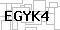
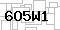
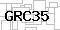
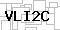

## Task
A website uses Captchas on a form in order to keep the web-bots away. However, the captchas it generates, are quite similar each time:
```
- the number of characters remains the same each time  
- the font and spacing is the same each time  
- the background and foreground colors and texture, remain largely the same  
- there is no skew in the structure of the characters.  
- the captcha generator, creates strictly 5-character captchas, and each of the characters is either an upper-case character (A-Z) or a numeral (0-9)/.  
```
Here, take a look at some of the captcha images on the form. As you can see, they resemble each other very much - just that the characters on each of them are different.  









You are provided a set of twenty-five captchas, such that, each of the characters A-Z and 0-9 occur at least once in one of the Captchas' text. From these captchas, you can identify texture, nature of the font, spacing of the font, morphological characteristics of the letters and numerals, etc. Download this sample set from here for the purpose of creating an offline model for this task.  

**Given a set of unseen captchas on the same web form, your task is to identify the text on each of the captchas.**  

**Input Format**

The first line of the input will contain two integers, **R** and **C**, which represent the number of rows and the number of columns of image pixels respectively.  
A 2D Grid of pixel values will be provided (in regular text format through STDIN), which represent the pixel-wise values from the images (which were originally in JPG or PNG formats).  
Each pixel will be represented by three comma separated values in the range 0 to 255 representing the **Blue, Green and Red** components respectively. There will be a space between successive pixels in the same row.  

**Constraints**

All images are of similar sizes.  

**R** = 30  
**C** = 60  
The input files containing the 2D grids of pixels representing these images will not exceed 10MB. All the captchas will be visually similar to the captcha images displayed above.  

**Output Format**

For each input file, the output should contain exactly one line containing a 5-character token, which represents the text of the captcha.  

**Sample Input**

This is for the purpose of explanation only. The real inputs will be larger than this (and will all contain 30 rows and 60 columns).
```
3 3  
0,0,200 0,0,10 10,0,0
90,90,50 90,90,10 255,255,255
100,100,88 80,80,80 15,75,255  
```
The first line indicates the number of rows and columns (3x3).  
The above is an image represented by 3x3 pixels. For each pixel the Blue, Green and Red values are provided, separated by commas. The top left pixel has (Blue=0,Green=0,Red=200). The top-right pixel has (Blue=10,Green=0,Red=0). The bottom-right pixel has (Blue=15,Green=75,Red=255). The bottom-left pixel has (Blue=100,Green=100, Red=88).  

**Sample Output**

This corresponds to the first of the sample images displayed in the problem statement.
SZ1KI

**Sample Output (2)**
This corresponds to the second of the sample images displayed in the problem statement.
ZR8UG

**Sample Output (3)**
This corresponds to the third of the sample images displayed in the problem statement.
J3GM4

**Explanation**

**Sample Images and TestCases**

You are provided a set of twenty-five captchas, such that each of the characters A-Z and 0-9 occur at least once in one of the Captchas' text. From these captchas, you can identify texture, nature of the font, spacing of the font, morphological characteristics of the letters and numerals, etc.  

Download this sample set [from here](http://hr-testcases.s3.amazonaws.com/2587/assets/sampleCaptchas.zip) for the purpose of creating an offline model for this task.  
